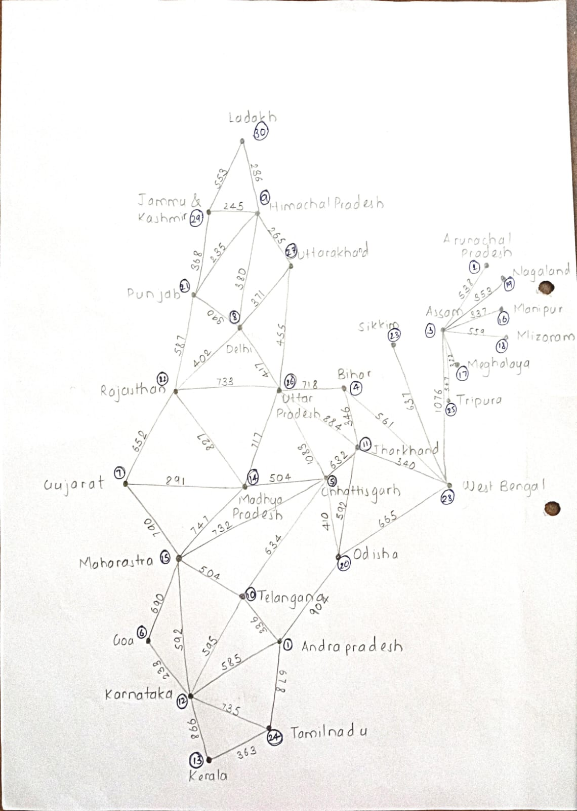

# 🗺️ Mapify — Shortest Path Finder

**Mapify** is a C++ Object-Oriented Programming project that finds the shortest route between two Indian states using **Dijkstra's Shortest Path Algorithm**.

The project represents Indian states as vertices of a weighted graph, where the connections between states represent distances. The application takes a source and destination state from the user and calculates the shortest possible route between them.

---

## 🚀 Features

- Find the shortest path between two states
- Uses **Dijkstra's Shortest Path Algorithm**
- Represents the map as a **weighted adjacency matrix**
- Supports **30 Indian states/regions**
- Displays the total distance from the source
- Displays the complete shortest route
- Uses C++ **Object-Oriented Programming**
- Uses STL `vector` instead of fixed-size C arrays
- Uses `string` for state/location names
- Input validation for source and destination

---

## 🧠 How It Works

Mapify models the locations as a weighted graph.

- **Vertices** → Indian states/regions
- **Edges** → Connections between states
- **Edge weights** → Distance between connected states
- **Dijkstra's Algorithm** → Finds the minimum-distance route

### Example

If the user selects:

```text
Source      → Maharashtra
Destination → Karnataka
```

Mapify calculates the shortest available route and displays:

```text
Shortest path from Maharashtra to Karnataka:

Destination    Distance from Source    Path

Karnataka      XXX                     Maharashtra -> ... -> Karnataka
```

---

## 🏗️ Project Structure

The current implementation is contained in:

```text
Mapify/
│
└── Mapify.cpp
```

The main class is:

```cpp
class Mapify
```

The class contains the graph, locations, Dijkstra algorithm, path reconstruction, and user interaction.

---

## 🧩 C++ OOP Concepts Used

### 1. Class

The entire application is organized using the `Mapify` class.

```cpp
class Mapify {
    // ...
};
```

### 2. Encapsulation

The graph, locations, and algorithmic functions are kept private.

```cpp
private:
    vector<string> locations;
    vector<vector<int>> graph;
```

The user interacts with the application through the public `run()` function.

### 3. Abstraction

The user does not need to know how Dijkstra's algorithm works internally.

They simply select:

```text
Source
Destination
```

and Mapify calculates the shortest path.

### 4. Object Creation

An object of the `Mapify` class is created in `main()`:

```cpp
Mapify mapify;
mapify.run();
```

---

## 📦 STL Containers Used

Instead of traditional C arrays, the project uses C++ STL containers.

### `vector`

Used for:

- Graph representation
- Distance array
- Visited vertices
- Parent vertices
- Shortest path

Example:

```cpp
vector<int> distance(V, INT_MAX);
vector<bool> visited(V, false);
vector<int> parent(V, -1);
```

The graph is represented using:

```cpp
vector<vector<int>> graph;
```

### `string`

State names are stored using:

```cpp
vector<string> locations;
```

This replaces traditional C-style character arrays.

---

## 🔢 Graph Representation

Mapify uses a **weighted adjacency matrix**.

```cpp
vector<vector<int>> graph
```

For example:

```text
       A
      / \
   300   500
    /     \
   B-------C
       200
```

The numbers represent distances between connected locations.

A value of `0` means that there is no direct connection between two locations.

---

## ⚙️ Dijkstra's Algorithm

The project uses Dijkstra's algorithm to calculate the shortest route.

### Basic process

1. Set the source distance to `0`.
2. Set all other distances to infinity.
3. Select the unvisited vertex with the smallest distance.
4. Mark it as visited.
5. Update the distances of its neighboring vertices.
6. Store the parent of every updated vertex.
7. Repeat until the destination is reached or no reachable vertices remain.
8. Reconstruct the path using the parent vector.

The main function responsible for this is:

```cpp
void dijkstra(int source, int destination)
```

---

## 🔄 Path Reconstruction

After Dijkstra's algorithm calculates the minimum distances, Mapify reconstructs the actual route.

A parent vector is maintained:

```cpp
vector<int> parent(V, -1);
```

The destination is traced backward until the source is reached.

The resulting path is then reversed:

```cpp
reverse(path.begin(), path.end());
```

This produces the route:

```text
Source → Intermediate State → Intermediate State → Destination
```

---

## 🗺️ Locations

The current version contains 30 locations including:

- Andhra Pradesh
- Arunachal Pradesh
- Assam
- Bihar
- Chhattisgarh
- Goa
- Gujarat
- Delhi
- Himachal Pradesh
- Telangana
- Jharkhand
- Karnataka
- Kerala
- Madhya Pradesh
- Maharashtra
- Manipur
- Meghalaya
- Mizoram
- Nagaland
- Odisha
- Punjab
- Rajasthan
- Sikkim
- Tamil Nadu
- Tripura
- Uttar Pradesh
- Uttarakhand
- West Bengal
- Jammu and Kashmir
- Ladakh

<p align="center">
  
</p>
---

## 🖥️ Program Flow

```text
                Start
                  │
                  ▼
           Display Locations
                  │
                  ▼
          Select Source State
                  │
                  ▼
       Select Destination State
                  │
                  ▼
          Run Dijkstra Algorithm
                  │
                  ▼
        Calculate Minimum Distance
                  │
                  ▼
          Reconstruct the Path
                  │
                  ▼
        Display Shortest Route
                  │
                  ▼
                 End
```

---

## 🛠️ Technologies Used

| Technology               | Purpose                       |
| ------------------------ | ----------------------------- |
| **C++**                  | Main programming language     |
| **OOP**                  | Application structure         |
| **STL Vector**           | Dynamic data storage          |
| **STL String**           | Location names                |
| **Dijkstra's Algorithm** | Shortest path calculation     |
| **Graph Theory**         | Map representation            |
| **Adjacency Matrix**     | Weighted graph representation |

---

## ▶️ How to Run

### Using g++

Compile the program:

```bash
g++ -std=c++17 Mapify.cpp -o Mapify
```

Run:

```bash
./Mapify
```

### Windows

```bash
g++ -std=c++17 Mapify.cpp -o Mapify.exe
```

Then:

```bash
Mapify.exe
```

---

## 💡 Sample Interaction

```text
====================================================
        Welcome To Mapify
====================================================

Source Locations:

1. Andhra Pradesh
2. Arunachal Pradesh
3. Assam
...
15. Maharashtra
...
30. Ladakh

Please Enter Source from where you have to travel:
15

Please Enter Destination to where you have to travel:
12
```

The program then calculates and displays the shortest route.

---

## 📊 Algorithm Complexity

For a graph represented using an adjacency matrix and the basic implementation of Dijkstra's algorithm:

### Time Complexity

```text
O(V²)
```

where `V` is the number of vertices.

For Mapify:

```text
V = 30
```

Therefore, the algorithm operates efficiently for the current 30-location graph.

### Space Complexity

```text
O(V²)
```

because the weighted adjacency matrix stores `V × V` values.

---

## 🔮 Future Improvements

Possible future enhancements include:

- 🖼️ Graphical visualization of the map
- 🗺️ Visual representation of states and connections
- 🔴 Highlighting the calculated shortest route
- 📍 Interactive source and destination selection
- 🖱️ Mouse-based interaction
- 📊 Display of route distance and intermediate states
- 🚗 Multiple route comparison
- 💾 Loading graph data from an external file
- ⚡ Priority Queue based Dijkstra implementation
- 🧩 Separate `Graph`, `Map`, and `Mapify` classes for improved modularity

---

## 🎯 Learning Outcomes

Through this project, I practiced:

- Object-Oriented Programming in C++
- Graph data structures
- Dijkstra's shortest path algorithm
- STL containers
- Dynamic data structures
- Path reconstruction
- Algorithmic problem solving
- Time and space complexity analysis
- Converting a procedural C implementation into an object-oriented C++ implementation

---

## 👨‍💻 Author

**Ishwari Nandargi**

B.Tech Computer Science & Engineering
Walchand College of Engineering

---

## ⭐ Project Goal

The goal of Mapify is to demonstrate how **graph algorithms and C++ Object-Oriented Programming** can be combined to solve a practical shortest-route problem.
